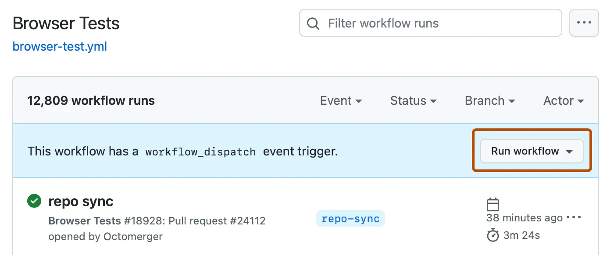
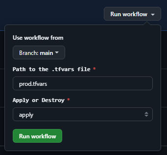
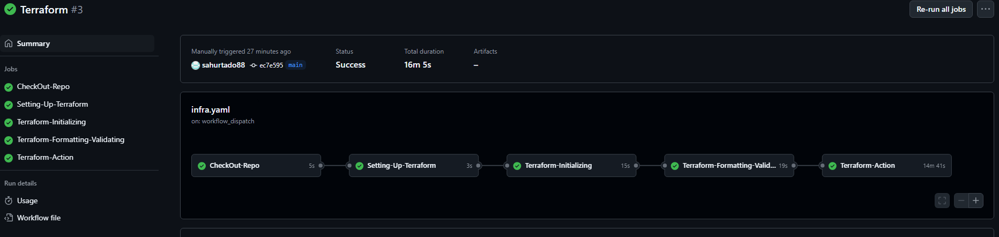

# Project

This repository hosts the implementation of a simple application where users cad add pizza order and the admini can see de order table this app using Django, Postgresql,  deployed on AWS EKS


## Pizza_delivery
The Application-Code directory contains the source code and dockerfiles. 

## Kubernetes 
The Kubernetes directory holds Kubernetes manifests for deploying your application on AWS EKS. 

## Infra
This directory have the terraform scripts for setting up EKS, RDS and ECR on AWS

## S3 backend

This Terraform module provisions the following resources to create S3 backend to terrafro tfstate file:

- IAM User: Creates a user in AWS IAM with administrative privileges.
- S3 Bucket: Sets up an S3 bucket to store Terraform state files, with versioning enabled and a bucket policy attached.
- DynamoDB Table: Creates a DynamoDB table for state locking and consistency checks when using Terraform.


# How Use this APP

# Infraestrucutre as Code

Para desplegar la infraestructura que soportara esta aplicacion ( EKS, ECR, RDS) se utilizo terraform y se usa el archvio prod.tfvars para realizar algunas configuraciones como poner la password de la postgress desplegada por RDS

en caso que necesite hacer alguna modificacion este es el archivo que debe generar

```
#prod.tfvars
environment = "prod"
db_password = "UQC7NxN0VyXs3S1MODnm3GH6cmYKOvdYsMDqDlrhB84"
region      = "us-east-1"
```

en caso de desplegar en otro ambiente cambiar el nombre de prod por dev o qa.

Para hacer mas automatico este despliegue de infraestrucutra se realizo una git hub action que se jecuta a demanda desde las gitub action para esto debe dirigirse al repo 

1. On GitHub, navigate to the main page of the repository. (https://github.com/sahurtado88/challenge)

2. Under your repository name, click  Actions.


3. In the left sidebar, click the name of the workflow terraform.


4. Above the list of workflow runs, click the Run workflow button.


5. Select the Branch dropdown menu and click a branch main to run the workflow on.



6. This workflow requires a .tfvars in this case you can write prod,tfvars
7. This workflow you can select the action that you want execute in terraform
    - PLAN: creates an execution plan, which lets you preview the changes that Terraform plans to make to your infrastructure 
    - APPLY: The terraform apply command executes planned actions, creating, updating, or deleting infrastructure resources to match the new state outlined in your IaC
    - DESTROY: This option terminates resources managed by your Terraform project

8. Click Run workflow.

9. After some minutes you can see the worflow success and your resources creates in AWS

 


# Deploy Application

Now you have your infraestructure is tiem to deploy the app, for this we created a workflow que cuando se realiza algun cmabio en el repositorio se dispara de forma automatica, este workflow lo que realiza este workflow es crear un dockerfile con los cmabios realizado y subir esta nueva version al ECR, donde esta imgen luego sera usada por el deployment de kubernetes de la aplicacion y tambien se despliega un servicio el cual crea un load balancer que nos da una url externa para poder consumir la aplicacion y poder hacer que los usuarios la utilicen, ademas de ejecutar un migrate para poder volver a tener todos nuestros modelos en la aplicacion
