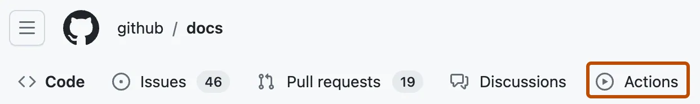

1. Test django

```
python manage.py test
```

2. Build container

Retrieve an authentication token and authenticate your Docker client to your registry. Use the AWS CLI:

```
aws ecr get-login-password --region us-east-1 | docker login --username AWS --password-stdin 183631329372.dkr.ecr.us-east-1.amazonaws.com
```

Note: If you receive an error using the AWS CLI, make sure that you have the latest version of the AWS CLI and Docker installed.

Build your Docker image using the following command. You can skip this step if your image is already built:

```
docker build -t 183631329372.dkr.ecr.us-east-1.amazonaws.com/pizza-delivery-app:latest -t 183631329372.dkr.ecr.us-east-1.amazonaws.com/pizza-delivery-app:v1 -f Dockerfile .

```

3. Push Container with 2 tags: latest and random After the build completes, tag your image so you can push the image to this repository:

```
docker push 183631329372.dkr.ecr.us-east-1.amazonaws.com/pizza-delivery-app --all-tags
```



4. Update secrets (if needed)

```
kubectl delete secret django-k8s-prod-env
kubectl create secret generic django-k8s-prod-env --from-env-file=.env.prod

```

5. Update Deployment `k8s/apps/django-k8s-web.yaml`:

Add in a rollout strategy:
`imagePullPolicy: Always`


### Four ways (given above) to trigger a deployment rollout (aka update the running pods):
- Forced rollout
Given a `imagePullPolicy: Always`, on your containers you can:

```
kubectl rollout restart deployment/django-k8s-web-deployment
```

- Image update:
```
kubectl set image deployment/django-k8s-web-deployment django-k8s-web=registry.digitalocean.com/cfe-k8s/django-k8s-web:latest
```

- Update an Environment Variable (within Deployment yaml):

```
env:
  - name: Version
    value: "abc123"
  - name: PORT
    value: "8002"
```

- Deployment yaml file update:

Change 
```
image: registry.digitalocean.com/cfe-k8s/django-k8s-web:latest
```
to
```
image: registry.digitalocean.com/cfe-k8s/django-k8s-web:v1 
```
Keep in mind you'll need to change `latest` to any new tag(s) you might have (not just `v1`)
```
kubectl apply -f k8s/apps/django-k8s-web.yaml
```


6. Roll Update:
```
kubectl rollout status deployment/django-k8s-web-deployment
```
7. Migrate database

Get a single pod (either method works)

```
export SINGLE_POD_NAME=$(kubectl get pod -l app=django-deployment -o jsonpath="{.items[0].metadata.name}")
```


Then run `migrate.sh` 

```
kubectl exec -it $SINGLE_POD_NAME -- ./migrate.sh
```


aws eks --region us-east-1 update-kubeconfig --name pizza-delivery-cluster


Outputs:

cluster_name = "pizza-delivery-cluster"
db_instance_address = "pizza-delivery-db.c1ks4gecq0ii.us-east-1.rds.amazonaws.com"
ecr_app_url = "183631329372.dkr.ecr.us-east-1.amazonaws.com/pizza-delivery-app"
ecr_proxy_url = "183631329372.dkr.ecr.us-east-1.amazonaws.com/pizza-delivery-proxy"
efs_csi_sa_role = "arn:aws:iam::183631329372:role/pizza-delivery-efs-csi20241014160436132700000015"
efs_id = "fs-0bf519e31c5eaa1e5"
region = "us-east-1"