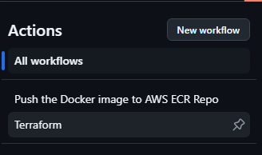

# Project

This repository hosts the implementation of a simple application where users cad add pizza order and the admini can see de order table this app using Django, Postgresql,  deployed on AWS EKS


## Pizza_delivery
The Application-Code directory contains the source code and dockerfiles. 

## Kubernetes 
The Kubernetes directory holds Kubernetes manifests for deploying your application on AWS EKS. 

## Infra
This directory have the terraform scripts for setting up EKS, RDS and ECR on AWS

## S3 backend

This Terraform module provisions the following resources to create S3 backend to terrafro tfstate file:

- IAM User: Creates a user in AWS IAM with administrative privileges.
- S3 Bucket: Sets up an S3 bucket to store Terraform state files, with versioning enabled and a bucket policy attached.
- DynamoDB Table: Creates a DynamoDB table for state locking and consistency checks when using Terraform.


# How Use this APP

# Infraestrucutre as Code

To deploy the infrastructure that will support this application (EKS, ECR, RDS), Terraform was used, and the prod.tfvars file is utilized for some configurations, such as setting the password for PostgreSQL deployed by RDS.

If any modifications are needed, this is the file that should be generated:

```
#prod.tfvars
environment = "prod"
db_password = "UQC7NxN0VyXs3S1MODnm3GH6cmYKOvdYsMDqDlrhB84"
region      = "us-east-1"
```

If you want to deploy to another environment, change the name prod to dev or qa.

To make this infrastructure deployment more automated, a GitHub Action was created, which can be triggered on-demand from GitHub Actions. To do this, navigate to the repository:

1. On GitHub, navigate to the main page of the repository. (https://github.com/sahurtado88/challenge)

2. Under your repository name, click  Actions.


3. In the left sidebar, click the name of the workflow terraform.


4. Above the list of workflow runs, click the Run workflow button.


5. Select the Branch dropdown menu and click a branch main to run the workflow on.


6. This workflow requires a .tfvars in this case you can write prod,tfvars
7. This workflow you can select the action that you want execute in terraform
    - PLAN: creates an execution plan, which lets you preview the changes that Terraform plans to make to your infrastructure 
    - APPLY: The terraform apply command executes planned actions, creating, updating, or deleting infrastructure resources to match the new state outlined in your IaC
    - DESTROY: This option terminates resources managed by your Terraform project

8. Click Run workflow.

9. After a few minutes, you will see the workflow succeed, and your resources will be created in AWS.

 


# Deploy Application

Now that your infrastructure is ready, it’s time to deploy the application. For this, we created a workflow that triggers automatically whenever a change is made to the repository. This workflow creates a Dockerfile with the changes and pushes this new version to ECR, where the image will then be used by the Kubernetes deployment of the application.

Additionally, the workflow deploys a service that creates a load balancer, giving us an external URL for users to access the application. It also runs a migrate command to ensure all models are up-to-date in the application.


____________________________

- The development team doesn't have full code test coverage and they ask to notify them immediately when the deployment process fails, failed condition includes the application being unable to start due to the bug in the code. How can we make sure the deployment process succeeds?

To ensure the deployment process succeeds, we can implement a rolling deployment strategy with health checks. This will gradually roll out the new version and ensure each pod is healthy before proceeding with the rest. Additionally, integrating monitoring and alerting mechanisms (using tools like Prometheus and Grafana) will notify the team if the application fails to start due to bugs.

A CI/CD pipeline should also include automated tests and canary deployments to test the new version with a small subset of users before full rollout. Even though full test coverage isn't available, any critical errors can be caught early in the canary phase.

- The Kubernetes node where the application was running has been automatically restarted during the vulnerability patching process. How we can make sure the existing orders are not getting lost?

To prevent data loss, ensure that the application stores orders in a persistent database like PostgreSQL, which isn't tied to a single node's lifecycle. This way, even if the Kubernetes node is restarted, the database will persist, and no orders will be lost.
Additionally, using Persistent Volumes (PVs) in Kubernetes can ensure that any in-process data is saved and reattached when the node restarts.


- When running multiple replicas of the application, how can we make sure about the data integrity?

To ensure data integrity while running multiple replicas, use a centralized database like PostgreSQL, ensuring all replicas read and write from the same source of truth.

- How can we make sure there will be no service interruption during the deployment phase?

Utilize a blue-green deployment or rolling update strategy to avoid service interruption. This will ensure that a new version of the application is fully tested and healthy before switching over traffic from the old version.

Additionally, set up readiness and liveness probes in Kubernetes to prevent traffic from being routed to unhealthy pods during the deployment phase.

- The marketing team is asking to test new application designs. The upstream load balancer is configured to split all incoming traffic into three endpoints: A, B, and C. How can we package the application in a way it can be installed multiple times using different versions but all the versions must display the same pizza orders?

Package the application in a way that each version (A, B, C) is containerized separately with its own namespace or Helm chart. This allows each version to be deployed independently, while all versions point to the same PostgreSQL database for the pizza orders.
Ensure that the database schema is backward-compatible so that all versions can interact with it correctly, regardless of the differences in the application logic or UI.

- The pizza ordering application became popular so the owner decided to scale the business and hired a development team to work on application features. The scaling plan includes mobile app development. It is expected the user base will grow significantly with thousands of online users making orders. What changes do you propose to the project and why?

Scale the infrastructure: Move to a multi-region setup on AWS using EKS for container orchestration and RDS for PostgreSQL, with read replicas to handle increased traffic.

Set up horizontal pod autoscaling (HPA) in Kubernetes for both the application and database to handle variable loads.

API Gateway for mobile support: Introduce an API gateway like AWS API Gateway to handle mobile traffic efficiently and ensure scalable backend interactions for the mobile app.

Implement a caching layer using Redis or Memcached to improve response times for frequent reads.

With increased traffic, invest in security best practices (WAF, IAM roles) and extend monitoring tools (Prometheus, Grafana, Loki) to ensure visibility into app performance and security.